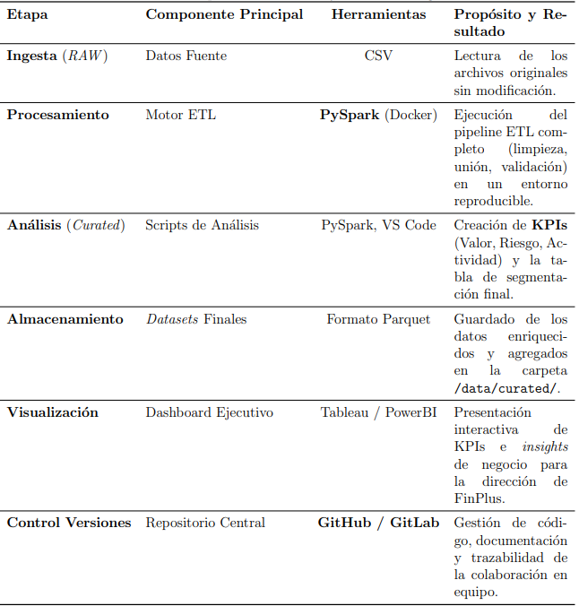
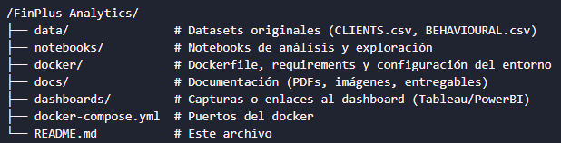

# FinPlus_Analitycs_Os_Fenómenos

## Solución analítica integral para la optimización del comportamiento de clientes en FinPlus.

### Descripción del proyecto

Nuestro objetivo es analizar y trazar una ruta sobre el comportamiento de cada uno de los clientes de Fin Plus para proponer mejoras tanto económicas como financieras.

Dentro de nuestros objetivos se encuentra el detectar riesgos de abandono, analizar tanto el comportamiento del cliente como el valor económico de Fin Plus y encontrar diferentes oportunidades de crecimiento.

### Roles y equipo

*Eva Sánchez Primo* $\rightarrow$ Tech Lead: Responsable de la arquitectura de la solución, la supervisión de calidad del código, la configuración del entorno Docker y de la gestión del respositorio en GitHub. Asegura que el pipeline de PySpark se ejecute de manera óptima.

*Marc Oliver del Horno* $\rightarrow$ Data Engineer: Encargado de la implementación del pipeline ETL en PySpark. Se centra en la ingesta, la limpieza de datos, el manejo de errores, la trasformación y la carga final de los datasets.

*José Enrique García Garay* $\rightarrow$ Data Visualization Expert: Responsable de la capa de comunicación y el diseño del documento de presentación. Define las métricas y visualizaciones necesarias para transmitir los insights de negocio de forma clara a la dirección.

*Pau Bisquert Sala* $\rightarrow$ Data Analyst: Lidera el análisis de comportamiento. Es responsable de la generación de KPIs, la creación de la lógica de segmentación y la elaboración de conclusiones para el informe.

### Arquitectura y tecnologías

*Lenguaje:* Python / PySpark.

*Entorno:* Docker.

*Control de versiones:* GitHub.

*Visualización:* Tableau / PowerBI.

Aquí se muestra el flujo de datos desde la ingesta hasta la visualización:

### Estuctura del repositorio

A continuación se mostrará la estructura del repositorio:

### Instalación y ejecución

Para la replicación de este proyecto deberemos seguir los siguientes pasos:

*1.* Tener Docker, Git y GitHub Desktop instalado.

*2.* Clonar el repositorio en nuestro ordenador.

*3.* Abrir Visual Studio, Docker y GitHub Desktop y realizar en terminal un 'docker-compose up --build'.

*4.* Copiar la URL y pegarla en un kernel de Jupiter Notebook.

*5.* Abrir una sesión de Spark ejecutando la primera celda de nuestro notebook.

### Flujo de Trabajo

Como hemos podido ver en el esquema anterior, nuestro flujo de trabajo ha sido el siguiente:

*1.* Ingesta

*2.* Procesamiento

*3.* Análisis

*4.* Almacenamiento

*5.* Visualización

*6.* Control de versiones

### Visualización y resultados

Todos los dashboards obtenidos los podemos encontrar en la carpeta 'dashboards' de nuestro repositorio

(falta)